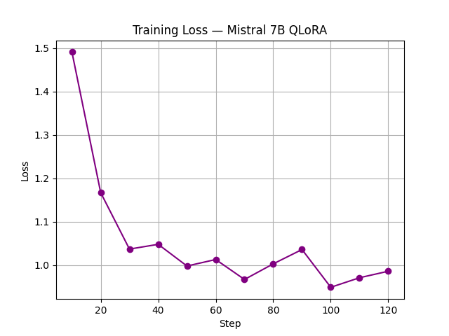

# 🏥 Mistral 7B - Medical Q&A Fine-tuning

Fine-tuned Mistral 7B on a Medical Q&A dataset using QLoRA (PEFT) for domain-specific medical question answering.

## 🚀 Project Overview
- **Base Model:** Mistral 7B v0.1
- **Method:** QLoRA (4-bit quantization + LoRA adapters)
- **Dataset:** Medical Q&A (1000 samples)
- **Trainable Parameters:** 3.4M out of 7.2B (0.047%)
- **Final Training Loss:** ~0.97
- **Hardware:** Lightning.ai GPU
- **Framework:** TRL + PEFT + Transformers

## 📉 Training Loss

## 🔧 Tech Stack
- Python
- PyTorch
- Hugging Face Transformers
- PEFT (Parameter Efficient Fine-Tuning)
- TRL (Transformer Reinforcement Learning)
- Gradio (UI)
- Lightning.ai (Training)

## 💬 Example Output
**Q:** What are the symptoms of diabetes?

**A:** The symptoms of diabetes are:
- Increased thirst
- Increased urination
- Increased hunger
- Weight loss
- Fatigue
- Blurred vision

## 🤗 Model on Hugging Face
[neelam-builds/mistral-7b-medical-finetuned](https://huggingface.co/neelam-builds/mistral-7b-medical-finetuned)

## 📁 Files
| File | Description |
|------|-------------|
| `train.ipynb` | Full training notebook |
| `app.py` | Gradio UI code |
| `requirements.txt` | Dependencies |
| `loss_curve.png` | Training loss plot |

## ⚠️ Disclaimer
This model is for educational purposes only.
Not a substitute for professional medical advice.
